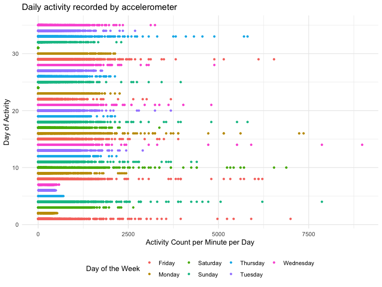

p8105_hw3_ef2721
================
Erfan Faridmoayer
2022-10-16

## Problem 1

#### Read in the data

``` r
data("instacart")

instacart = 
  instacart %>% 
  as_tibble(instacart)
```

#### Answer questions about the data

This dataset contains 1384617 rows and 15 columns, with each row
representing a single product from an instacart order. Variables include
identifiers for user, order, and product; the order in which each
product was added to the cart. There are several order-level variables,
describing the day and time of the order, and number of days since prior
order. Then there are several item-specific variables, describing the
product name (e.g. Yogurt, Avocado), department (e.g. dairy and eggs,
produce), and aisle (e.g. yogurt, fresh fruits), and whether the item
has been ordered by this user in the past. In total, there are 39123
products found in 131209 orders from 131209 distinct users.

Below is a table summarizing the number of items ordered from aisle. In
total, there are 134 aisles, with fresh vegetables and fresh fruits
holding the most items ordered by far.

``` r
instacart %>% 
  count(aisle) %>% 
  arrange(desc(n))
```

    ## # A tibble: 134 × 2
    ##    aisle                              n
    ##    <chr>                          <int>
    ##  1 fresh vegetables              150609
    ##  2 fresh fruits                  150473
    ##  3 packaged vegetables fruits     78493
    ##  4 yogurt                         55240
    ##  5 packaged cheese                41699
    ##  6 water seltzer sparkling water  36617
    ##  7 milk                           32644
    ##  8 chips pretzels                 31269
    ##  9 soy lactosefree                26240
    ## 10 bread                          23635
    ## # … with 124 more rows
    ## # ℹ Use `print(n = ...)` to see more rows

Next is a plot that shows the number of items ordered in each aisle.
Here, aisles are ordered by ascending number of items.

``` r
instacart %>% 
  count(aisle) %>% 
  filter(n > 10000) %>% 
  mutate(aisle = fct_reorder(aisle, n)) %>% 
  ggplot(aes(x = aisle, y = n)) + 
  geom_point() + 
  labs(title = "Number of items ordered in each aisle") +
  theme(axis.text.x = element_text(angle = 60, hjust = 1))
```


Our next table shows the three most popular items in aisles
`baking ingredients`, `dog food care`, and `packaged vegetables fruits`,
and includes the number of times each item is ordered in your table.

``` r
instacart %>% 
  filter(aisle %in% c("baking ingredients", "dog food care", "packaged vegetables fruits")) %>%
  group_by(aisle) %>% 
  count(product_name) %>% 
  mutate(rank = min_rank(desc(n))) %>% 
  filter(rank < 4) %>% 
  arrange(desc(n)) %>%
  knitr::kable()
```

| aisle                      | product_name                                  |    n | rank |
|:---------------------------|:----------------------------------------------|-----:|-----:|
| packaged vegetables fruits | Organic Baby Spinach                          | 9784 |    1 |
| packaged vegetables fruits | Organic Raspberries                           | 5546 |    2 |
| packaged vegetables fruits | Organic Blueberries                           | 4966 |    3 |
| baking ingredients         | Light Brown Sugar                             |  499 |    1 |
| baking ingredients         | Pure Baking Soda                              |  387 |    2 |
| baking ingredients         | Cane Sugar                                    |  336 |    3 |
| dog food care              | Snack Sticks Chicken & Rice Recipe Dog Treats |   30 |    1 |
| dog food care              | Organix Chicken & Brown Rice Recipe           |   28 |    2 |
| dog food care              | Small Dog Biscuits                            |   26 |    3 |

Finally is a table showing the mean hour of the day at which Pink Lady
Apples and Coffee Ice Cream are ordered on each day of the week. This
table has been formatted in an untidy manner for human readers. Pink
Lady Apples are generally purchased slightly earlier in the day than
Coffee Ice Cream, with the exception of day 5.

``` r
instacart %>%
  filter(product_name %in% c("Pink Lady Apples", "Coffee Ice Cream")) %>%
  group_by(product_name, order_dow) %>%
  summarize(mean_hour = mean(order_hour_of_day)) %>%
  spread(key = order_dow, value = mean_hour) %>%
  knitr::kable(digits = 2)
```

    ## `summarise()` has grouped output by 'product_name'. You can override using the
    ## `.groups` argument.

| product_name     |     0 |     1 |     2 |     3 |     4 |     5 |     6 |
|:-----------------|------:|------:|------:|------:|------:|------:|------:|
| Coffee Ice Cream | 13.77 | 14.32 | 15.38 | 15.32 | 15.22 | 12.26 | 13.83 |
| Pink Lady Apples | 13.44 | 11.36 | 11.70 | 14.25 | 11.55 | 12.78 | 11.94 |

## Probelm 2

``` r
accel_df = 
  read_csv("./accel_data.csv") %>% 
  janitor::clean_names() %>%
  pivot_longer(
    activity_1:activity_1440,
    names_to = "activity_number",
    values_to = "activity_count") %>%
  mutate_at("activity_number", str_replace, "activity_", "") %>% 
  mutate(activity_number = as.numeric(activity_number)) %>% 
  mutate(day_type = ifelse(day %in% c("Saturday", "Sunday"), "weekend", "weekday")) %>% 
  select(week:day, day_type, everything())
```

    ## Rows: 35 Columns: 1443
    ## ── Column specification ────────────────────────────────────────────────────────
    ## Delimiter: ","
    ## chr    (1): day
    ## dbl (1442): week, day_id, activity.1, activity.2, activity.3, activity.4, ac...
    ## 
    ## ℹ Use `spec()` to retrieve the full column specification for this data.
    ## ℹ Specify the column types or set `show_col_types = FALSE` to quiet this message.

The code chunk above contains the new `accel_df`, which contains 50400
rows and 6 columns. The data has been a modification of the
accelerometer data to contain the following variables of interest: week
of collection, day number of collection, the day of the week data was
collected, whether this was a weekday, the activity number record of
collection, and lastly the associated activity count per minute.

``` r
accel_df %>%
  group_by(day_id, day_type) %>%
  summarize(
    daily_act = sum(activity_count)
  ) %>% 
  knitr::kable(digits = 2)
```

    ## `summarise()` has grouped output by 'day_id'. You can override using the
    ## `.groups` argument.

| day_id | day_type | daily_act |
|-------:|:---------|----------:|
|      1 | weekday  | 480542.62 |
|      2 | weekday  |  78828.07 |
|      3 | weekend  | 376254.00 |
|      4 | weekend  | 631105.00 |
|      5 | weekday  | 355923.64 |
|      6 | weekday  | 307094.24 |
|      7 | weekday  | 340115.01 |
|      8 | weekday  | 568839.00 |
|      9 | weekday  | 295431.00 |
|     10 | weekend  | 607175.00 |
|     11 | weekend  | 422018.00 |
|     12 | weekday  | 474048.00 |
|     13 | weekday  | 423245.00 |
|     14 | weekday  | 440962.00 |
|     15 | weekday  | 467420.00 |
|     16 | weekday  | 685910.00 |
|     17 | weekend  | 382928.00 |
|     18 | weekend  | 467052.00 |
|     19 | weekday  | 371230.00 |
|     20 | weekday  | 381507.00 |
|     21 | weekday  | 468869.00 |
|     22 | weekday  | 154049.00 |
|     23 | weekday  | 409450.00 |
|     24 | weekend  |   1440.00 |
|     25 | weekend  | 260617.00 |
|     26 | weekday  | 340291.00 |
|     27 | weekday  | 319568.00 |
|     28 | weekday  | 434460.00 |
|     29 | weekday  | 620860.00 |
|     30 | weekday  | 389080.00 |
|     31 | weekend  |   1440.00 |
|     32 | weekend  | 138421.00 |
|     33 | weekday  | 549658.00 |
|     34 | weekday  | 367824.00 |
|     35 | weekday  | 445366.00 |

In the above code chunk, we used the `group_by` function to isolate data
based on unique day_id, and used the `summarize` function to find the
aggregate activity count per day. In the table showing the results, I am
unable to find any particular trends. Prior to presentation, I used to
rank function and included the type of day of exercise to see a trend,
but was unable to find any.

``` r
accel_df %>%
  ggplot(aes(x = activity_count, y = day_id, color = day)) + 
  geom_point(size = 1) + 
  labs(
    title = "Daily activity recorded by accelerometer",
    x = "Activity Count per Minute per Day",
    y = "Day of Activity") + 
  scale_color_hue(name = "Day of the Week")
```



From the single-panel plot, it can be inferred that the person is very
active starting at midnight, and less active as the day progresses.
There are multiple Saturdays were there are no activities recorded. I
cannot find a trend in terms of change in global activity throughout the
study period. Overall, it seems that this person is less active over the
weekends in the last two weekends of the study.

# Problem 3

``` r
data("ny_noaa")

noaa_df = ny_noaa %>% 
  janitor::clean_names()
```

The `ny_noaa` dataset contains 2595176 rows and 7 columns. Variables
include satellite id for area of interest, date of observation,
precipitation, amount of snow, depth of snow, and the max and min
temperatures. It does seem from an overview that there are a lot of `NA`
variables in the dataset.
